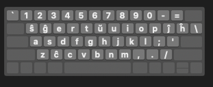

# Esperanta MacOS Klavararanĝo

Estas ankaoraŭ MacOS Klavararanĝo por Esperanto, kun pli konsekvenca bildsimbolo.

Ĉi tiu klavararanĝo uzas ŜĜERTŬ aranĝon:

## Instalado

1. Elekti `dark.icns` por malluma bildsimbolo aŭ `light.icns` por luma bildsimbolo, tiam kopii kaj anstatauigi `./Esperanto.bundle/Contents/Resources/Esperanto (ŜĜERTŬ).icns`
2. Kopii `Esperanto.bundle` kaj alglui en `~/Library/Keyboard Layout`; Krei la dosierujo se ĝi ne ekzisti.
3. Elsaluti kaj tiam ensaluti denove

## Permesilo

MIT.

 La bildsimbolo estas disponebla laŭ la permesilo <a rel="license" href="http://creativecommons.org/licenses/by-sa/4.0/">Krea Komunaĵo Atribuite-Samkondiĉe 4.0 Tutmonda</a>.

# Esperanto MacOS Kyborad Layout

This is another MacOS Kyborad Layout for Esperanto with a more consistent icon.

This keyboard layout uses ŜĜERTŬ layout:

## Installation

1. Choose `dark.icns` for dark icon or `light.icns` for light icon, then copy and replace `./Esperanto.bundle/Contents/Resources/Esperanto (ŜĜERTŬ).icns`
2. Copy `Esperanto.bundle` and paste in `~/Library/Keyboard Layout`; create the folder if it do not exist.
3. log out and log in again.

## License

MIT.

 The icon is licensed under a <a rel="license" href="http://creativecommons.org/licenses/by-sa/4.0/">Creative Commons Attribution-ShareAlike 4.0 International License</a>.

